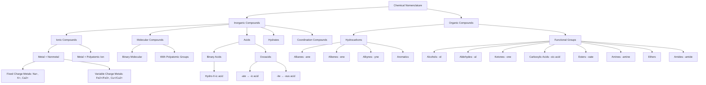
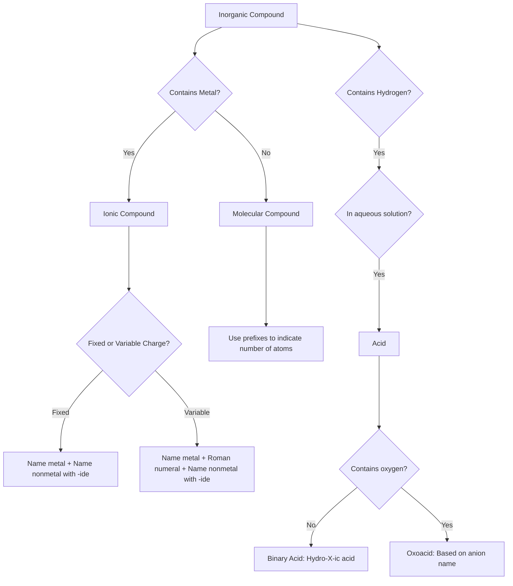
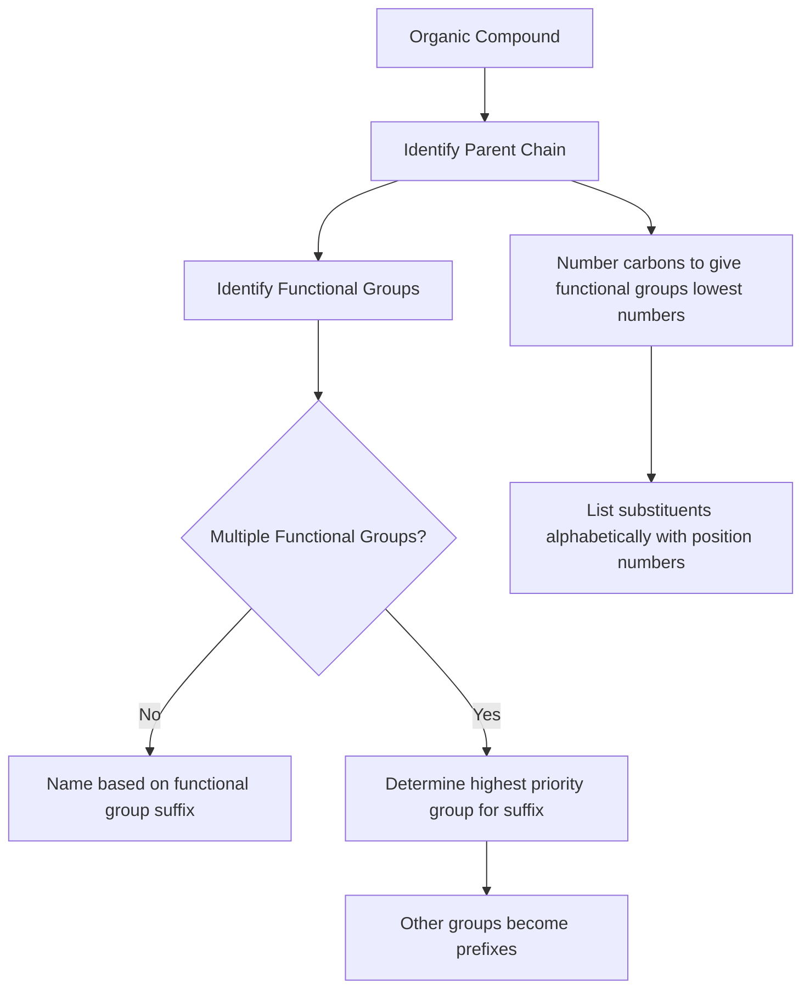
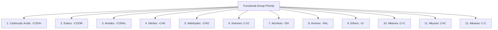
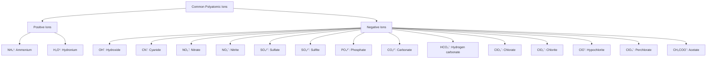
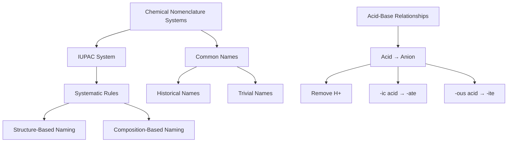
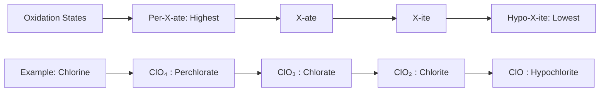

# Chemical Nomenclature Concept Map

## Chemical Nomenclature

## Rules for Naming Inorganic Compounds

## Rules for Naming Organic Compounds

## Functional Group Priority Hierarchy

## Common Polyatomic Ions

## Key Relationships Between Naming Systems

## Progression of Oxidation States in Nomenclature

## Note
For the concept maps to render properly, you'll need a Markdown viewer that supports Mermaid diagrams. Many modern Markdown editors and viewers support this syntax, including GitHub, GitLab, and VSCode with the appropriate extensions.
